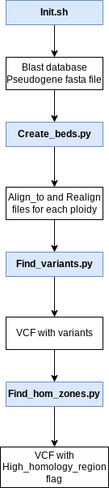

# Variant calling in highly homologous regions
This pipeline is designed to perform variant calling on regions with high homology to a pseudogene by masking all of them with the exeption of one that will represent the rest.

## Required Input
This pipeline requires:
  - A reference genome.
  - A gff3 annotation of the reference genome.
  - A fastq file with the reads we want to do variant calling on.
  
## How to use it?
All the steps the pipeline have been divided in 4 different python scripts that can be run separately or together with **Execute_all.py**. If each script is going to be run separately the next steps must be followed:

  - **STEP_01:** The first script to be run is _Init.sh_ since it will create the genes Blast database and the pseudogenes fasta file required to run the rest of the pipeline.
  - **STEP_02:** Once the necessary files are created, _Create_beds.py_ must be executed to make the Align_to and Realign bed files used in the next step for variant calling.
  - **STEP_03:** With the bed files created _Find_variants.py_ must be run in order to create a vcf file with all the mutations detected in regions of high homology.
  - **STEP_04:** Once the last step has finished _Find_hom_zones.py_ can be run to add the 'High_Homology_Region' flag to any variant in a zone that presented high similarity with a pseudogene.



Either the pipeline is run by **Execute_all.py** or executing each step separately all the python and bash scripts in this GitHub must be in the same directory.

### Example
Here there is a template of the commands to execute for running the pipeline:
  - If the pipeline is going to be executed in one go, then the only script that must be run is Execute_all.py.
```
Execute_all.py -R reference_genome.fasta -A annotation.gff3 -I reads.fastq -ID ID_of_the_sample -SM Sample_name -O output.vcf -t number_of_threads -Qual quality_threshold_for_variants -Id_threshold Maximum_identity_threshold_a_region_can_have_to_a_pseudogene -pl maximum_ploidy
```
  - If instead the pipeline is going to be executed step by step, these are the commands that must be run:
```
bash Init.sh reference_genome annotation.gff3 output_directory 
```

```
python Create_beds.py -fp Pseudogene_fasta_file -bl blast_database -OM Align_to_bed_files_directory -OR Realign_bed_files_directory -Id_threshold Maximum_identity_threshold_a_region_can_have_to_a_pseudogene -pl ploidy
```

```
python Find_variants.py -I reads.fastq -ID ID_of_the_sample -SM Sample_name -t Number_of_threads -O Output.vcf -real Realign_bed_files_directory -Al_to Align_to_bed_files_directory -R reference.fasta -Qual quality_threshold_for_variants
```

  - Additionally if a boxplot showing the quality of the variants is going to be made the script 

## Dependencies
To run this pipeline the following libraries are required:
  - GATK
  - BEDTOOLS
  - BLAST+
  - ARGPARSE
  - PICARD
 
 This github already provides a YML file called _main_env.yml_ with a conda environment possessing the necessary dependencies to run the pipeline.
